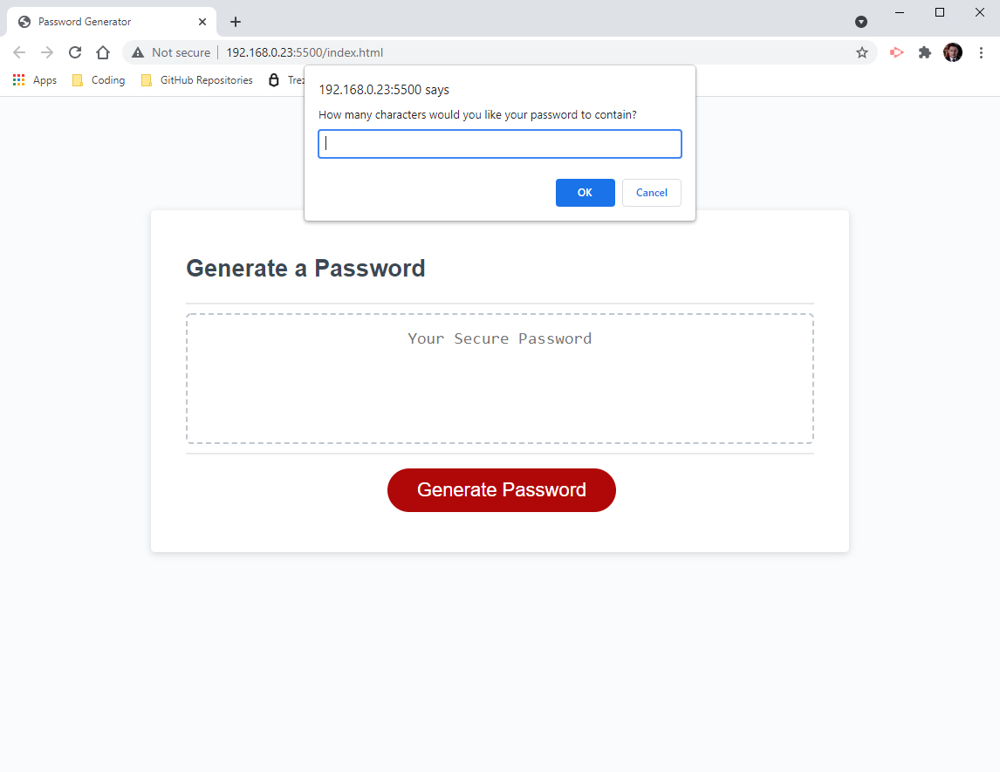
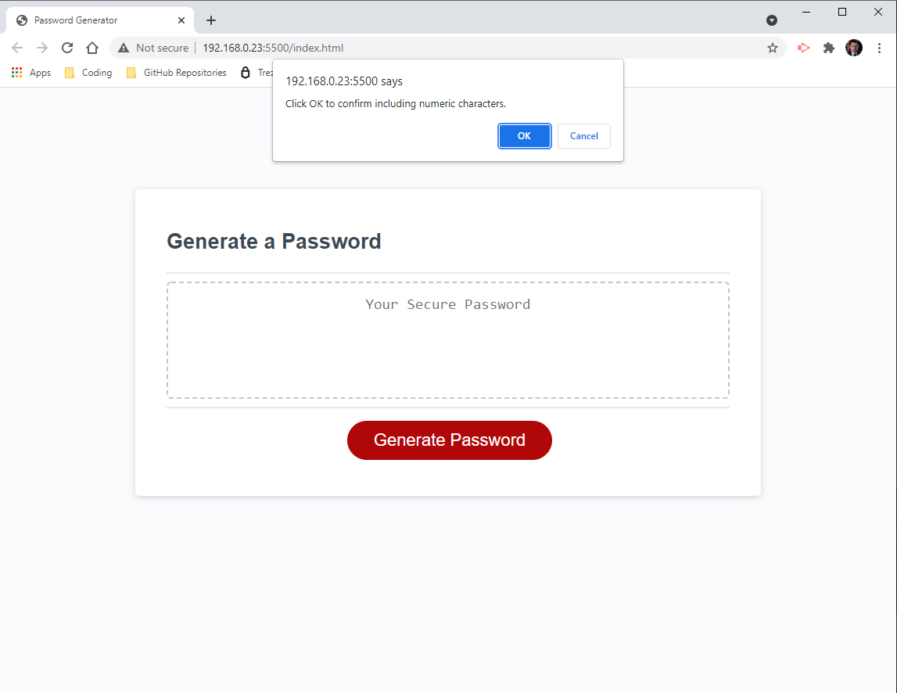
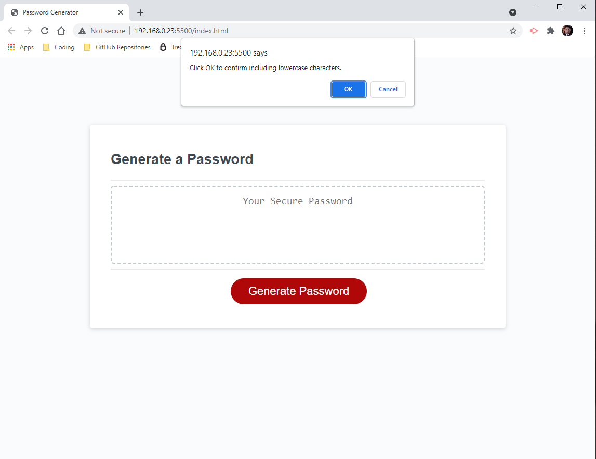
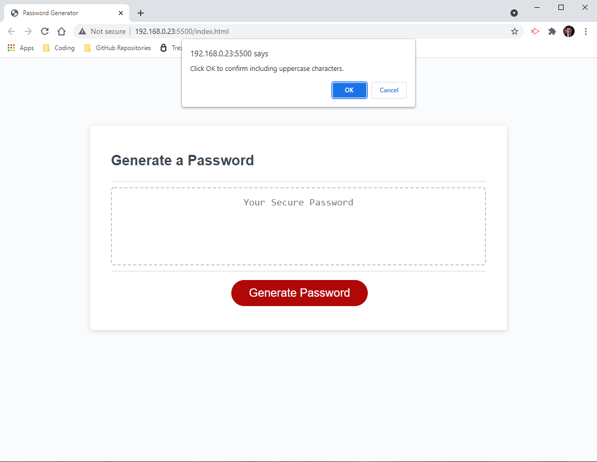
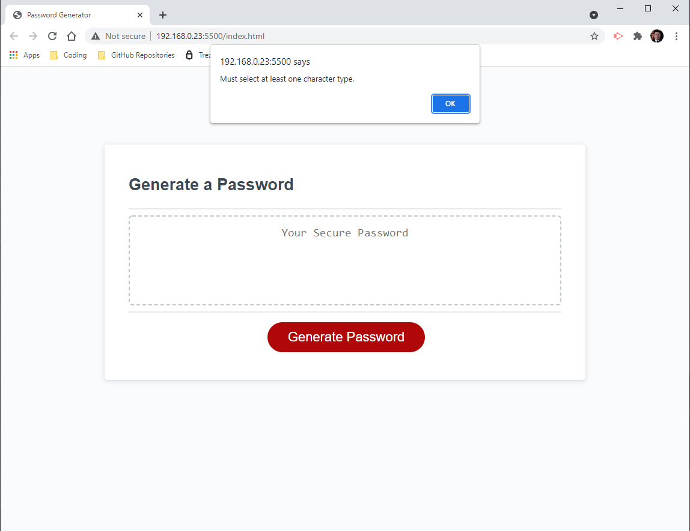
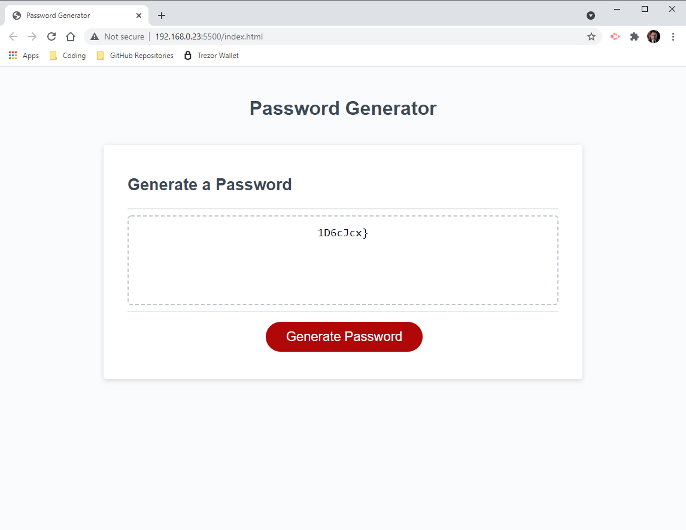
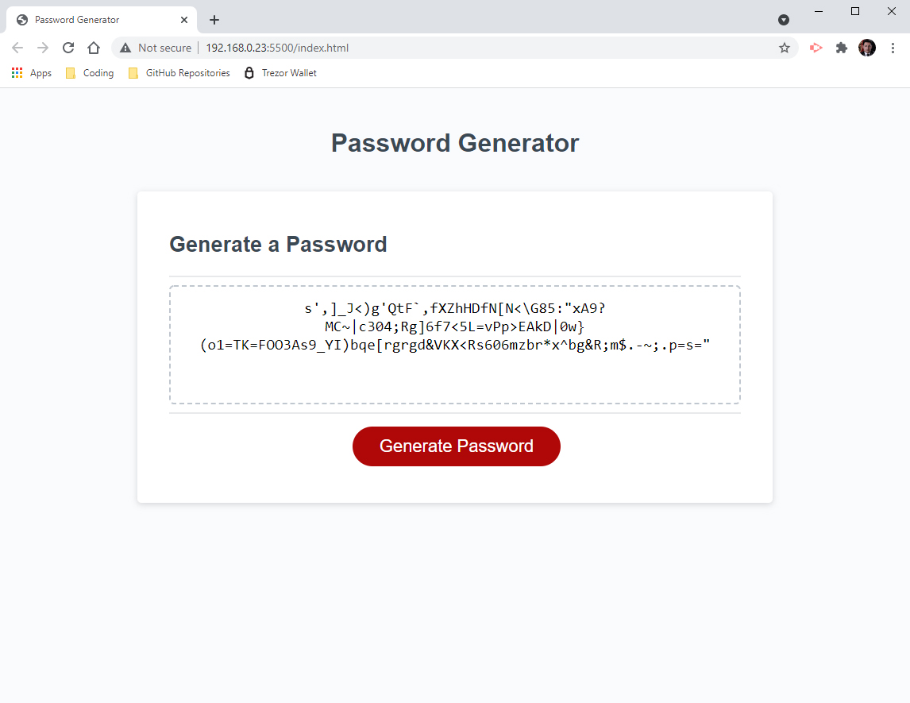

## Password Generator

## User Story
```
AS AN employee with access to sensitive data
I WANT to randomly generate a password that meets certain criteria
SO THAT I can create a strong password that provides greater security
```

## Acceptance Criteria
```
GIVEN I need a new, secure password
WHEN I click the button to generate a password
THEN I am presented with a series of prompts for password criteria
WHEN prompted for password criteria
THEN I select which criteria to include in the password
WHEN prompted for the length of the password
THEN I choose a length of at least 8 characters and no more than 128 characters
WHEN prompted for character types to include in the password
THEN I choose lowercase, uppercase, numeric, and/or special characters
WHEN I answer each prompt
THEN my input should be validated and at least one character type should be selected
WHEN all prompts are answered
THEN a password is generated that matches the selected criteria
WHEN the password is generated
THEN the password is either displayed in an alert or written to the page
```

## Solution
```
This is the home page before any click:


Then you will be asked to choose how many characters you need, it has to be a number between 8 to 128 or it will not proceed to the next step:



Then you will be asked series of questions to determine your desired password criteria:








At least one criteria has to be selected or you will get a message and password generator will start over:



This is the generated password if all ceriterias are selected and the length is set to 8 characters long:



This is the generated password if all ceriterias are selected and the length is set to 128 characters long:



Finally this is the link to my deployed application: https://ashariat.github.io/password-generator/
